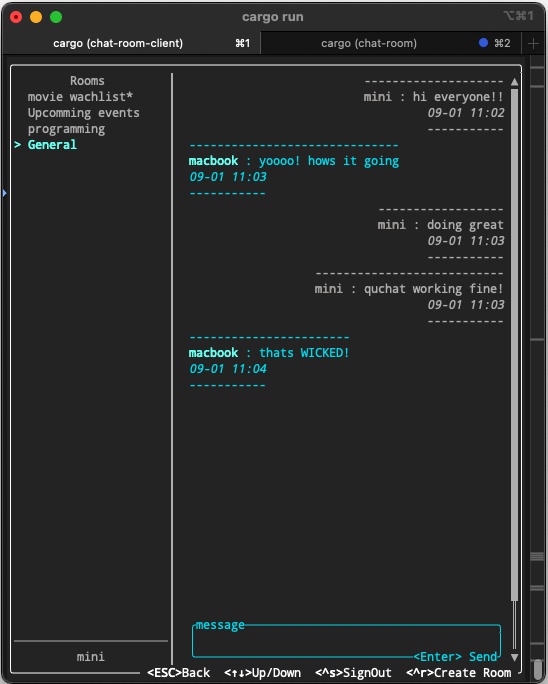

<table>
<tr>
<td></td>
<td></td>
<td></td>
</tr>
</table>

**quchat** is a chat room service written from scratch in Rust. My main purpose for it was to enable local server deployment, allowing a terminal-based client to connect, create rooms, and start chatting. It is still a work in progress, and I personally haven't tested it a lot, so it may contain some bugs. While chat services typically have numerous features, I focused on implementing the core capabilities of a chat application to to make the base functionalities working.
### Current Features:
- JWT authentication
- Create and read list of rooms
- Receive updates in room list when a room has new messages
- Mark rooms as seen
- Get live updates of messages inside a room
- Send text messages
### How to Run It:
To run the server locally, define the IP address of the machine where you want to host the server in `chat-room-server/Rocket.toml`. Then, run the clients and enter the server address that you configured on the welcome page.

### Server:
The server uses [Rocket](https://rocket.rs) for most interactions, which are handled through HTTP requests.
- For live updates, it utilizes Rocket's [EventStream](https://api.rocket.rs/master/rocket/response/stream/struct.EventStream) feature.
- For authentication, I implemented JWT without relying on external libraries.
- It uses SQLite for data persistence; however, I plan to replace it with Redis and PostgreSQL later for improved performance.
### Client:
The client uses [Ratatui](https://ratatui.rs) for rendering in the terminal. Since the application can end up in complicated states, I defined all states and actions in enum formats and used a state machine to manage actions and produce their corresponding states. It utilizes multiple [tokio](https://tokio.rs/) spawn and channels to handle networking and long-running tasks, preventing UI freezing. A lightweight [reqwest](https://docs.rs/reqwest/latest/reqwest/) wrapper is also used for all networking communication with the server.